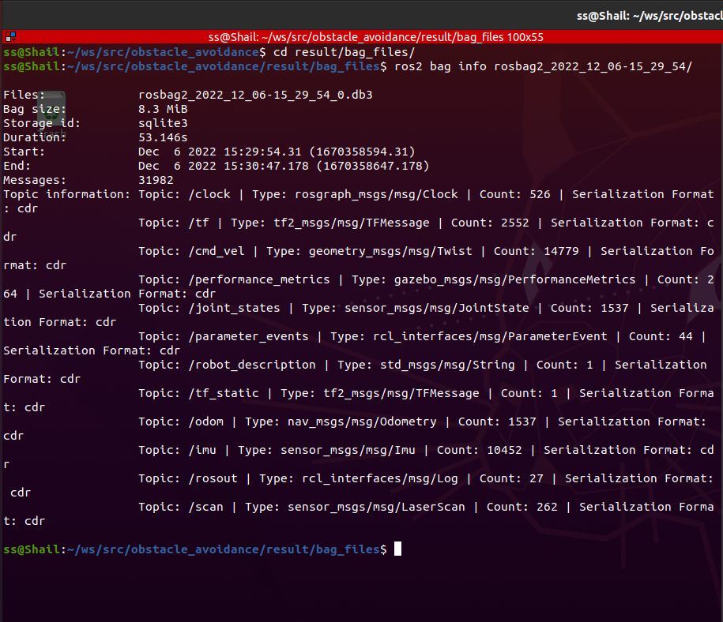

[](https://opensource.org/licenses/Apache-2.0)

# Working with Gazebo
ENPM-808X | Assignment | Week 12

```
Name - Shail Kiritkumar Shah

UID - 119340547

Assignment - Working with Gazebo (Week 12)
```

## Overview

* This assignment is designed to understand the concept of simulation in gazebo environment and hence following task has been designed to get an understanding of the same:

1) Created a ROS package, Git Repository and worked in the 'Week12_HW' branch for all the commits.

2) Created a code with class definition for providing velocity commands in desired direction in response to obstacles detected in launched environment.

3) Scripted a launch file to init node, record bag and launch turtlebot3 in turtlebot3_world.

4) Recorded the bag and saved the result in result folder of the movement of turtlebot and checked the bag file using ros2 bag info command:


5) Ran cpplint and cppcheck by creating a '*.sh*' file and saved output in '*result*' folder. 

6) Added open source license to the repository, cpp files, and modified the license tag in package.xml.

7) Updated *readme.md* file to inculcate build and run steps.

## Dependencies

| Type     | Description |
| ----------- | ----------- |
| Operating System     | Ubuntu Linux 20.04       |
| ROS version   | ROS 2 - Galactic        |
| ROS Code dependencies | rclcpp (ROS Client Lib for C++)
| | sensor_msgs
| | geometry_msgs 

## Build instructions

Open terminal from source directory of ROS2 workspace or navigate to the path from *Home* using following command:
```
cd ~/ws/src
```
Clone GitHub repository:
```
git clone --recursive https://github.com/sshah115/obstacle_avoidance.git
```
Build the ROS2 package by going back to workspace's root directory:
```
cd ~/ws
```
Checking for any missing dependencies before building:
```
rosdep install -i --from-path src --rosdistro galactic -y
```
Build package:
```
colcon build --packages-select obstacle_avoidance
```


## Run instructions

Next step is to run the program and for that open a new terminal and navigate to ROS2 workspace:
```
cd ~/ws
```
Source the setup files:
```
. install/setup.bash
```
### **Running nodes using launch.yaml**
Navigate to bag_files folder so that the recorded file can be saved in that directory:
```
cd ~/ws/src/obstacle_avoidance/result/bag_files/
```
Run launch file:
```
ros2 launch obstacle_avoidance turtle_launch.py bag_record:=True

```

## Run cpp-tests
To check for cpptests i.e cpplint & cppcheck, just write following command from package directory to output and save *.txt* file in *result* folder:
```
sh cpptests.sh
``` 